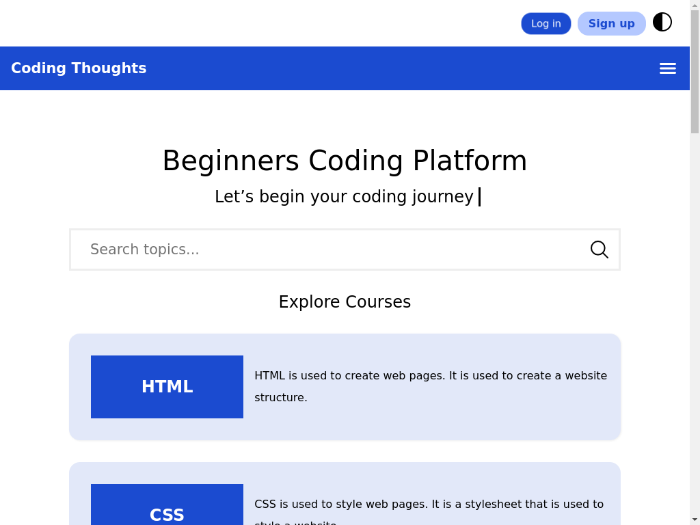

<!--
**VinaySharma77/vinaysharma77** is a ✨ _special_ ✨ repository because its `README.md` (this file) appears on your GitHub profile.

# Here are some ideas to get you started:
-->

# Hello Friends

- 🔭 I’m currently working on Java GUI Programming
- 🌱 I’m currently learning Problem Solving
- 👯 I’m looking to collaborate on Programming
- 🤔 I’m looking for help with this (Project)[https://vinaysharma77.github.io/vinaysharma77/]
- 💬 Ask me about This Project

- ⚡ Fun fact: this website developement play for me

## view

## feature

- Knowledgable
- Free Learning
- Example in Code
- Responsive
- Theme Modes

### So why are you waiting for just visit 

# ThoughtsOfCoding Project <https://vinaysharma77.github.io/ThoughtsOfCoding/>
